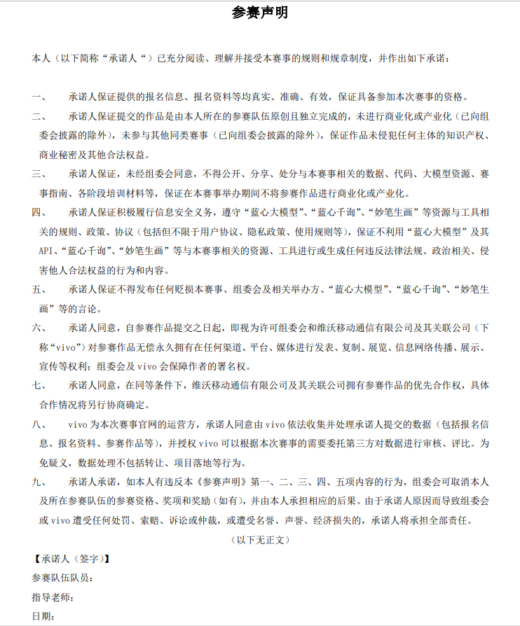
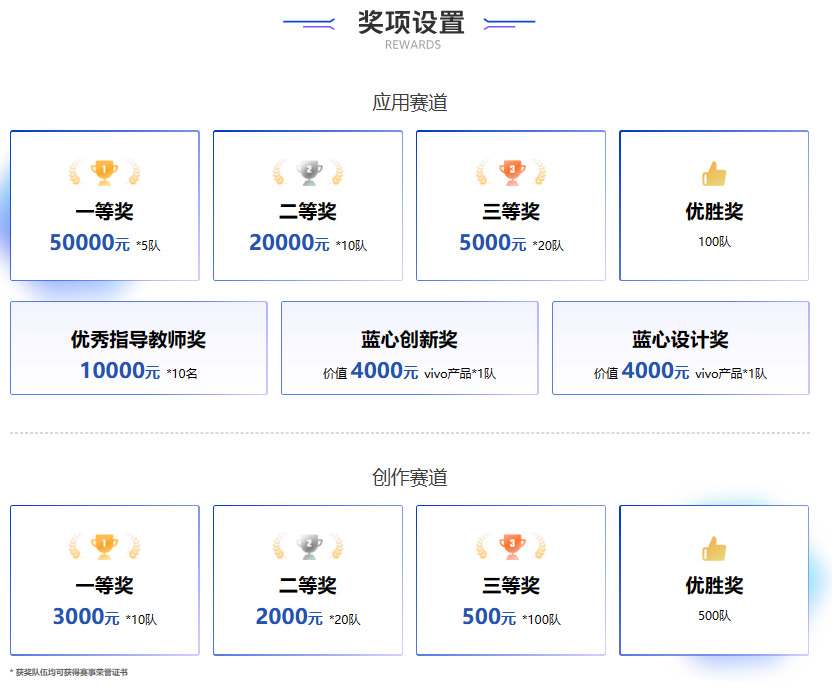
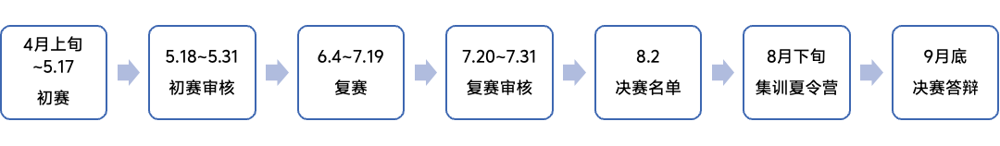
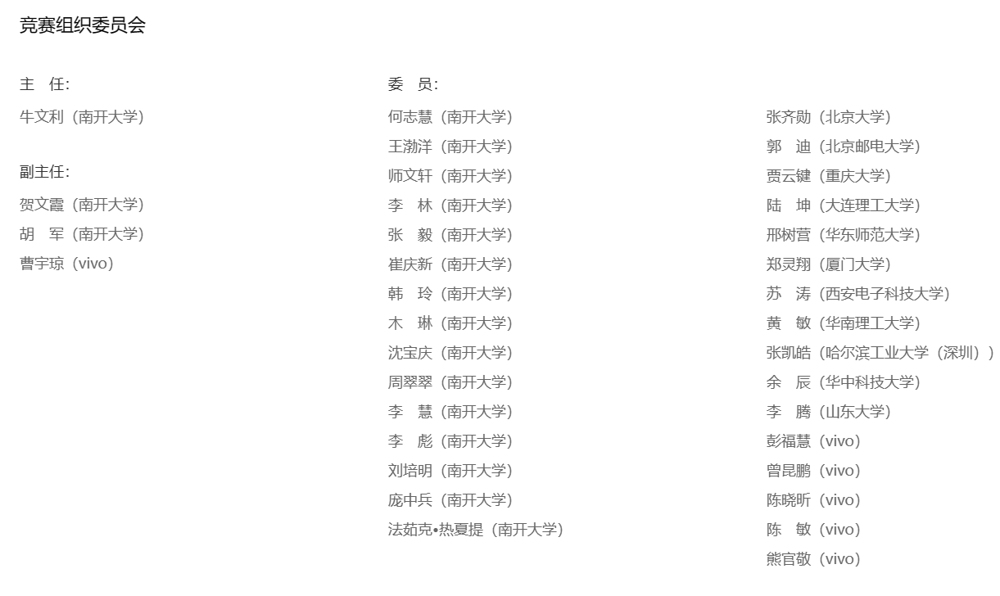
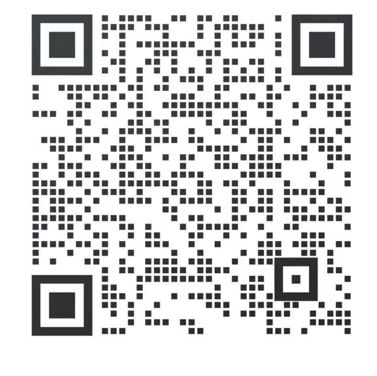

# Meeting on VIVO's AIGC Competition

报名方式：在赛事主页点击`我要报名`，注册账号并进行报名
> 国内访问:<https://aigc.vivo.com>
> 翻墙访问:<https://aigc.vivo.com.cn>

[参赛声明](./docs/attachments/中国高校计算机大赛%20-%20AIGC创新赛-参赛声明%20pdf.pdf)

## 赛事基本信息介绍

> Ref：[主页](https://aigc.vivo.com) | [竞赛规则](https://aigc.vivo.com/#/info/CPN20240401-002)

### 竞赛简介

"中国高校计算机大赛"（China Collegiate Computing Contest，简称C4）由教育部高等学校计算机类专业教学指导委员会、教育部高等学校软件工程专业教学指导委员会、教育部高等学校大学计算机课程教学指导委员会、全国高等学校计算机教育研究会于2016年创办。
第一届（2024年）“中国高校计算机大赛-AIGC创新赛”（以下简称“竞赛”）由南开大学与vivo公司联合承办。该竞赛面向全国高校在校学生，以vivo自研通用大模型矩阵为技术底座，助力AIGC应用创新和内容创作，携手青年开发者共同推动大模型前沿技术快速发展，实现AI普惠。

### 奖项设置

1、 应用赛道奖项设置

决赛的35个作品，以决赛最终成绩排名，评定一二三等奖：

一等奖：5名，奖金5万元，并颁发荣誉证书

二等奖：10名，奖金2万元，并颁发荣誉证书

三等奖：20名，奖金5000元，并颁发荣誉证书

此外，应用赛道设置3个特别奖和100名优胜奖：

优秀指导教师奖：10名，奖励1万元，并颁发荣誉证书

蓝心创新奖：1名，奖励价值4000元vivo产品并颁发荣誉证书

蓝心设计奖：1名，奖励价值4000元vivo产品并颁发荣誉证书

优胜奖：100名，授予荣誉证书

2、创作赛道奖项设置

以最终成绩排名，选拔评审结果前130名的作品，评定一二三等奖：

一等奖：10名，奖金3000元，并颁发荣誉证书

二等奖：20名，奖金2000元，并颁发荣誉证书

三等奖：100名，奖金500元，并颁发荣誉证书

优胜奖：500名，授予荣誉证书

### 竞赛主题

#### 应用赛道

参赛者通过使用蓝心大模型矩阵API，包括已开源的7B和最高70B的云端大模型、AI绘画与传统AI能力等，针对某一特定主题或应用场景，包括但不限于系统实用工具、社交通讯、生活服务、教育、健康、出行、影像、办公、资讯、金融、购物、音乐等场景，设计和开发具有创新性的应用、网页或demo等。复赛阶段，开放云真机和大模型端侧化能力，请在设计时考虑端侧化场景。决赛阶段，提供微调算力，帮助队伍进一步完善作品。

| 阶段           | 时间         |
|--------------|------------|
| 报名开始       | 即日起       |
| 报名&初赛作品提交截止 | 5/17       |
| 复赛作品提交截止  | 7/19       |
| 集训夏令营      | 8月下旬      |
| 决赛答辩       | 9月下旬      |

#### 创作赛道

参赛者通过使用蓝心千询、妙笔生画等工具，创作图片类、文本类、乐曲（含乐谱、歌词、音频等）、代码类、视频类（视频脚本输出）等作品。允许参赛队伍使用三方工具协助输出完整创作作品，但核心内容必须使用蓝心千询与妙笔生画工具输出。

| 阶段           | 时间         |
|--------------|------------|
| 报名开始       | 即日起       |
| 报名&初赛作品提交截止 | 5/31       |
| 获奖名单公布  | 7月下旬       |

#### 参赛要求

本次竞赛面向全国高等学校（含港澳台）在校学生，参赛学生不限专业，可跨年级、跨专业、跨校和跨校区自由组队。限定每位学生只能报名一种赛道，且每支队伍限定提交一份作品。

- 应用赛道
每个参赛队伍的学生不超过5人，需要1-2名指导教师
同一名指导教师可以指导多个参赛队伍，负表竞赛阶段中的作品指导和联系等工作。

- 创作赛道
每个参赛队伍的学生不超过3人，至多1名指导教师(高校在职教师)

### 赛制说明

#### 应用赛道赛制说明

应用赛道分为初赛、复赛、集训夏令营、决赛三个阶段，初赛、复赛于线上举办，均在赛区范围内进行作品选拔。进入决赛的队伍，赛事组会组织集训夏令营，由南开大学教授与vivo技术专家亲自指导，完善作品。

1）应用赛道赛程安排

2）应用赛道提交作品规范
| 赛段  | 参赛形式 | 提交作品要求 |
|-------|---------|------------|
| 初赛  | 在线提交 赛区评比  | 1、必须提交：作品策划文档，提交格式PPT或doc   2、选择提交：作品宣传海报、demo效果、部分源代码等 |
| 复赛  | 在线提交 赛区评比 | 1、必须提交：更完善的作品策划文档，提交格式PPT或doc   2、必须提交：产品原型图、部分源代码等   3、必须提交：产品演示视频 |
| 决赛  | 线下答辩 全国评比 | 1、提交线下答辩PPT；   2、提交完整的项目方案书文档；   3、 提交可在规定设备实际运行的demo及项目效果视频 |

3）应用赛道评审规则

评审专家以竞赛专家委员会专家为主，秉持公平、公正的原则进行评审。竞赛组织委员会负责评审过程的组织和监督。初赛和复赛均采取线上评审方式，全国总决赛采取线下公开答辩的评审方式，每个阶段的成绩不带入下一阶段。各赛段的评审专家团由南开大学甄选出各高校教授和vivo技术专家组成。

应用赛道一二三等奖的评审规则分为作品完成度、应用价值、创新能力、选题定位四个维度，占比分别为30%、30%、30%、10%。

初赛阶段由7个赛区每个赛区选拔初赛作品排名前30名的队伍进入复赛阶段，共计210个作品。复赛阶段每个赛区推选出复赛作品排名前5名的队伍进入决赛阶段，最终进入决赛阶段的共计35支队伍，共计35个作品。

初赛阶段七大赛区每个赛区邀请10名评审专家负责初赛作品的评审，其中包括5名高校专家与5名vivo专家。复赛阶段七大赛区每个赛区邀请5名评审专家负责复赛作品的评审，其中包括2-3名高校专家与2-3名vivo专家。决赛阶段将邀请14名评审专家，其中包括7名高校专家与7名vivo专家，对决赛作品进行现场答辩评审。

#### 创作赛道赛制说明

略

### 竞赛工具

#### 蓝星大模型

vivo自研通用大模型矩阵——蓝心大模型，强大的语言理解能力和丰富的场景应用，大而全、算法强、真安全、自进化，带你进入人工智能的新时代！
[立即了解](https://developers.vivo.com/product/ai/bluelm)
[查看文档](https://aigc.vivo.com/#/document/index?id=1746)

#### AI原子能力

vivo AI原子能力矩阵，提供ASR、TTS、视觉技术、自然语言处理、LBS等能力，供参赛者自由组合，创新应用场景
[查看文档](https://aigc.vivo.com/#/document/index?id=1746)

#### 蓝心千询

你的AI伙伴，可以在学习、工作、生活上为你提供便捷高效的贴心服务，包括但不限于任意问题答疑解惑、文本创作、美图生成、文档处理、情感聊天等，更可以定制你专属的智能体，快来和蓝心千询聊聊吧～
[立即体验](https://qianxun.vivo.com/download/index.html)

#### 妙笔生画

输入文本或者图片即可创作艺术作品， 一句话画出你的奇思妙想，风格多样， 给用户带来全新的绘画创作体验。 支持基于文本生成图片、 图片转换风格、图片消除路人等功能。
[立即体验](https://developers.vivo.com/product/ai/aipainting)

### 竞赛组织

### 常见QA

1、报名组队常见QA

Q1、是否可以跨校组队参赛？

A1、允许跨赛区、跨校、跨年级、跨专业自由组队，每支参赛队伍人数不超过对应赛道要求上限即可。队伍所在赛区以队长学校所在赛区为准。

 

Q2、指导教师是否必须为队长所在学校老师？

A2、指导教师须为在职高校教师，任何学校都行，不限定队长或队员学校。

 

Q3、即将六月份毕业的学生能否参加2024年比赛

A3、参赛者应为在校生或2024年1月1日之后毕业的学生，在此之前毕业的学生不具备参赛资格。

2、赛题与参赛作品相关QA

Q1、如何使用蓝心大模型？

A1、请查看蓝心大模型API接入指导

 

Q2、参赛作品是否需要实现？

A2、初赛作品以作品创意和设计策划为主，有一定实现demo会作为加分项；从复赛阶段开始，作品需要以成品形式演示

 

Q3、开发参赛作品是否可以使用第三方工具？

A3、大赛不限定开发平台，允许使用第三方工具，但必须在文档中明确说明引用的第三方软件，说清楚哪些是使用别人的，哪些是自己开发的。

 

### 交流联系

（1）赛事组邮箱：aigccontest@nankai.edu.cn

（2）赛事交流QQ群

747069135（①群 已满）

667556303（②群）

666340111（③群）

746637504（④群）

（3）添加竞赛小助手微信

## 应用赛道作品构想

> 必须提交：作品策划文档，提交格式PPT或doc
> 选择提交：作品宣传海报、demo效果、部分源代码等

## 讨论